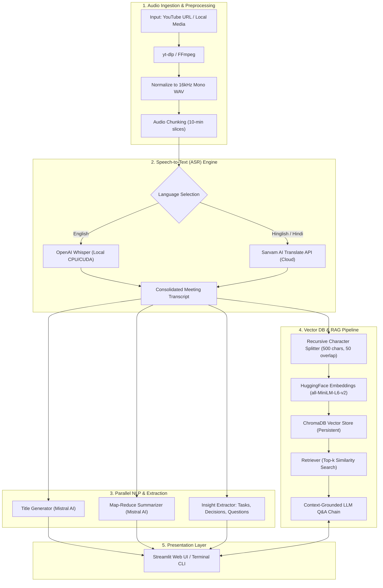

# 🎬 AI Video & Meeting Assistant

An intelligent, production-grade AI Meeting and Video Assistant that ingests YouTube videos or local recordings, generates accurate speech-to-text transcripts across languages (English & Hinglish), synthesizes executive summaries and action items using LLMs, and powers an interactive **Retrieval-Augmented Generation (RAG)** chat over the meeting contents.

---

## 🏗️ System Architecture



---

## 📂 Project Directory Structure

```text
AI-Video-Assistant/
├── backend/                        # Pure Python business logic & AI pipelines
│   ├── __init__.py                 # Backend package exports
│   ├── audio_processor.py          # YouTube download, format conversion & chunking
│   ├── transcriber.py              # ASR: Whisper (local) & Sarvam AI (cloud translation)
│   ├── llm_service.py              # Mistral AI client & model configuration
│   ├── summarizer.py               # Map-Reduce summarization & structured extraction
│   ├── rag_engine.py               # ChromaDB vector store, embeddings & RAG Q&A chain
│   └── pipeline.py                 # Central orchestrator connecting all backend steps
│
├── frontend/                       # Web presentation layer
│   ├── app.py                      # Modern two-panel Streamlit dashboard
│   ├── styles.py                   # Custom UI styles, theme variables, and CSS
│   └── .streamlit/
│       └── config.toml             # Streamlit server & browser configuration
│
├── data/                           # Data storage (git-ignored)
│   ├── downloads/                  # Processed audio files and WAV chunks
│   └── vector_db/                  # Persistent ChromaDB sqlite and index files
│
├── tests/                          # Validation and integration tests
│   └── test_pipeline.py            # Unit & NLP pipeline tests
│
├── .env                            # Environment variables (API keys, model flags)
├── .env.example                    # Template environment file
├── .gitignore                      # Git exclusion rules
├── app.py                          # Root entry point wrapper for Streamlit
├── main.py                         # Standalone interactive Terminal CLI
├── requirements.txt                # Pinned project dependencies
├── run.bat                         # Windows batch launcher (interactive menu)
├── run.ps1                         # PowerShell launcher script
└── README.md                       # Architecture, design decisions & documentation
```

---

## ⚡ How It Works (Step-by-Step)

### 1. Ingestion (`backend/audio_processor.py`)
- **YouTube Ingestion**: Uses `yt-dlp` to extract the best available audio stream without downloading heavy video files.
- **Audio Standardization**: Audio is converted to a uniform **16kHz mono WAV** format via `pydub` / `ffmpeg`, which is the optimal sample rate for Whisper and Sarvam models.
- **Chunking Strategy**: Long recordings are split into 10-minute chunks with a minimum length threshold to prevent out-of-memory errors and handle large files efficiently.

### 2. Speech-to-Text Transcription (`backend/transcriber.py`)
- **English**: Uses local **OpenAI Whisper** models (`tiny`, `base`, or `small`). Fast, private, and runs directly on CPU or GPU without external API costs.
- **Hinglish / Hindi**: Uses **Sarvam AI (`saaras:v2.5`)** Speech-to-Text Translate API. Audio is divided into 25-second slices and sent via a thread pool to transcribe and translate code-mixed speech into clean English.

### 3. Hierarchical Summarization & Extraction (`backend/summarizer.py`)
- **Adaptive Summarization**:
  - *Short transcripts*: Direct single-pass prompt.
  - *Long transcripts*: **Map-Reduce** pattern — individual transcript sections are summarized in parallel, and then combined into a cohesive executive summary.
- **Structured Information Extraction**: Uses LangChain Expression Language (LCEL) chains to reliably extract:
  - **Action Items** (Task, Owner, Deadline)
  - **Key Decisions**
  - **Open Questions & Follow-ups**
- **Title Generation**: Generates an 8-word descriptive meeting title.

### 4. RAG Q&A Engine (`backend/rag_engine.py`)
- **Text Splitting**: The transcript is chunked using `RecursiveCharacterTextSplitter` (chunk size: 500, overlap: 50).
- **Dense Embeddings**: Generated locally using `sentence-transformers/all-MiniLM-L6-v2` (384-dimensional dense vectors).
- **Vector Storage**: Stored in a local **ChromaDB** collection.
- **Context-Constrained Q&A**: LangChain LCEL chain retrieves the top-4 relevant chunks and strictly conditions Mistral AI to answer using *only* the retrieved meeting context, preventing hallucinations.

---

## 🚀 Quick Start Guide

### 1. Prerequisites
- Python 3.10 or higher
- [FFmpeg](https://ffmpeg.org/download.html) installed and available in system PATH.

### 2. Configuration
Create a `.env` file in the project root (or copy from `.env.example`):
```env
MISTRAL_API_KEY=your_mistral_api_key_here
SARVAM_API_KEY=your_sarvam_api_key_here
MISTRAL_MODEL=open-mistral-nemo
WHISPER_MODEL=base
```

### 3. Install Dependencies
```bash
pip install -r requirements.txt
```

### 4. Running the Project

#### Option A: Streamlit Web UI (Recommended)
```bash
python -m streamlit run frontend/app.py
```
*(Or simply `streamlit run app.py` from root)*

#### Option B: Terminal CLI Mode
```bash
python main.py
```

#### Option C: One-Click Launchers (Windows)
- Double-click `run.bat` or run `.\run.ps1` in PowerShell.

---

## 💡 Interview Talking Points & Design Decisions

| Question | Architectural Rationale |
| :--- | :--- |
| **Why separate Backend & Frontend?** | Decouples business logic from presentation. The `backend` package can be imported into a CLI, Streamlit, or converted into FastAPI/Flask REST endpoints with zero modifications to AI code. |
| **Why Map-Reduce for Summarization?** | LLM context windows can degrade on massive 1-2 hour transcripts. Map-Reduce ensures equal fidelity across all parts of the meeting while staying within token limits. |
| **Why ChromaDB + Local Embeddings?** | Completely local vector indexing with zero recurring API costs for embedding generation. Persistent on disk in `data/vector_db/`. |
| **Why Hybrid Whisper + Sarvam?** | Whisper performs exceptionally on standard English, while Sarvam AI specializes in Indic accents, Hindi, and code-mixed Hinglish speech, translating it into English. |
| **How is CPU utilization managed?** | `torch.set_num_threads()` limits thread saturation on multi-core systems, preventing UI freezes and WebSocket dropouts during transcription. |
| **How are hallucinations prevented?** | The RAG system prompt explicitly forces the LLM to ground its answers strictly in the retrieved context and declare when an answer is not present. |
